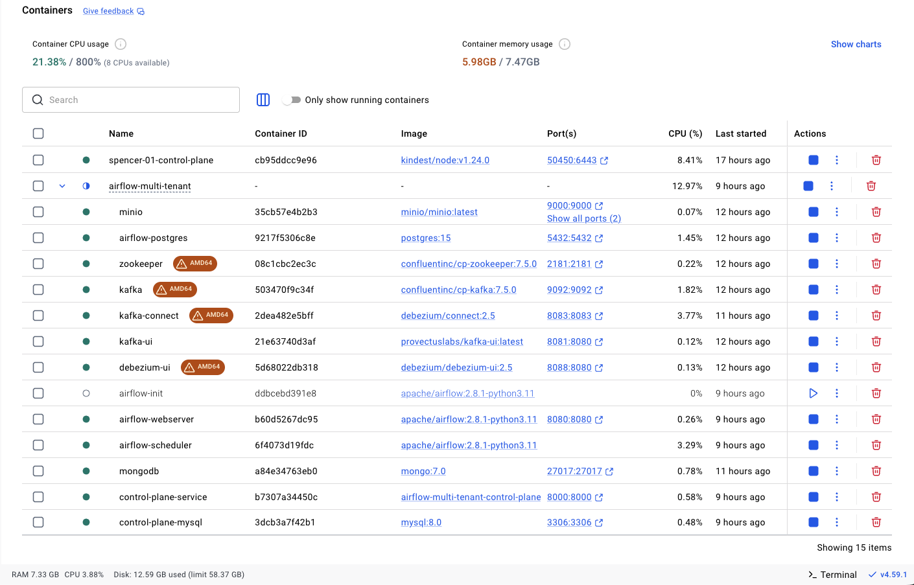
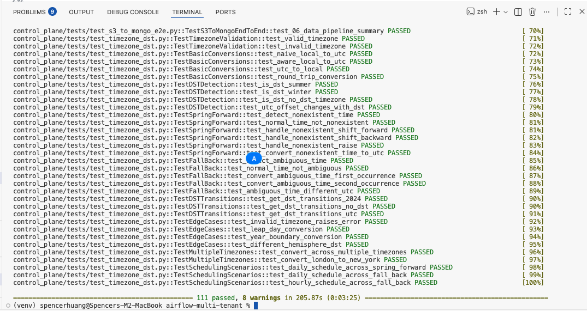
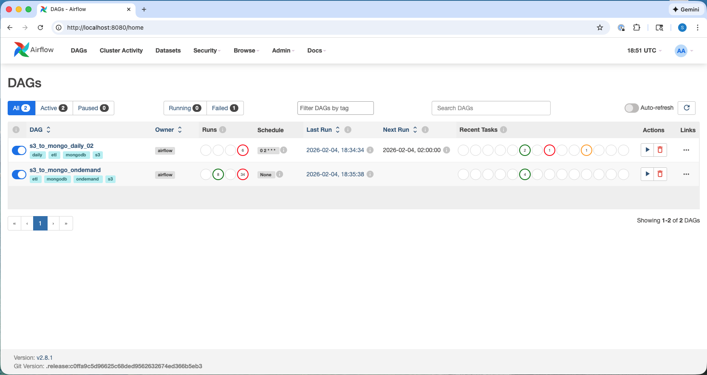
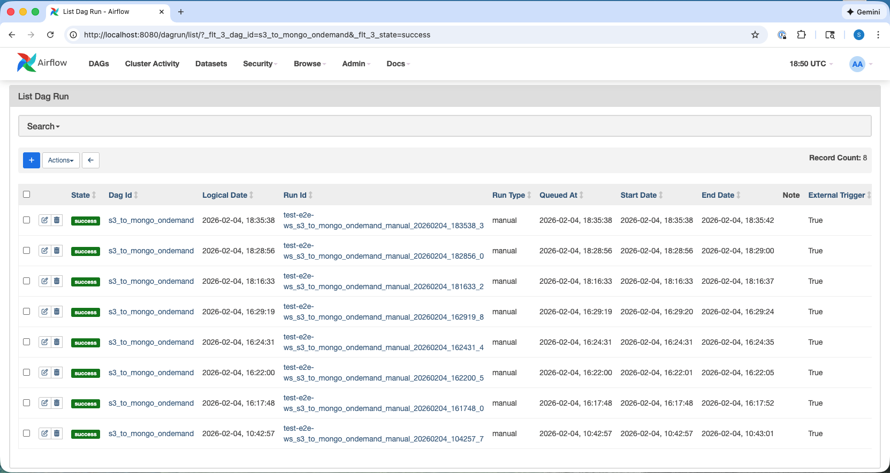

[](https://github.com/spencerhuang/airflow-multi-tenant/actions/workflows/unit-tests.yml)

# Multi-Tenant and Event-Driven Airflow System

A scalable Airflow-based system supporting multi-tenancy and event-driven architecture with hybrid scheduling, CDC, and reusable connectors.

## Features

- **Multi-tenancy**: Hundreds of tenants/customers, many DAG runs
- **CDC-driven orchestration**: Debezium-triggered runs
- **Workflow-based DAGs**: Each group of DAGs represents a use case (e.g., s3_to_mongo)
- **Hybrid scheduling**: Airflow-native daily schedules + dispatcher-based weekly/monthly
- **Reusable connectors**: S3, Azure, MongoDB, MySQL connectors shared across workflows
- **Hotspot detection**: There's a limit to max_active_runs, this tries to anticipate potential ceilings for scheduled workflows/dags
- **Operational safety**: DST handling, backfill control, worker-slot efficiency

## Product/Business statement

What is it?

At its core, every business use case becomes a workflow, moving data from one system to another so it can create value. In my case, that means taking PDFs stored in AWS S3 and transforming them into structured data in MongoDB, either through a one time full load or a daily scheduled pipeline. On the surface, this looks like something you could quickly assemble using community templates from tools like n8n. But once the workflow becomes business critical, the real challenges emerge: traceability, observability, and reliable execution at scale. At that point, tools like n8n start to feel more like internal productivity utilities rather than production infrastructure, especially if you are the one who has to explain to customers why yesterday’s scheduled workflow did not run.

Who is it for?

Data Engineers, Product Owner/Manager, Data Scientists, ML Engineers, AI Engineers, Business Analysts in Academic or Small Medium Business.

Why is it relevant?

Regardless you're doing EDA or fine-tuning LLM, you need data to start your ingestion/training pipeline. This project will bootstrap your data needs not just for the near-term, but robust enough to expand in the long run.

How does it compare?

No existing solution provides a turnkey, open-source, self-hosted platform that combines Airflow-compatible orchestration, Kafka-native event-driven architecture, and true single-instance multi-tenancy.

| Capability | This Project | Kestra | Dagster | Astronomer Astro | AWS MWAA |
|---|---|---|---|---|---|
| Single-instance multi-tenancy | ✅ (SMB) | Enterprise only | ✅ | ❌ (separate deploys) | ❌ |
| Kafka-native event-driven | ✅ | ✅ | ❌ | ❌ | ❌ |
| Airflow-compatible | ✅ | ❌ (YAML) | ❌ | ✅ | ✅ |
| Open-source & self-hosted | ✅ | ✅ | ✅ | ❌ | ❌ |

Managed Airflow providers (Astronomer, MWAA, Cloud Composer) solve multi-tenancy by spinning up separate environments per tenant — expensive and operationally heavy. Kestra is the closest architecturally but uses YAML workflows instead of the Airflow ecosystem. Dagster has good multi-tenancy but no native Kafka event backbone.

## Architecture Overview

```
Control Plane Service (REST API, port 8000)
 |
 v
Business DB (MySQL) --> CDC (Debezium) --> Kafka --> Kafka Consumer Service (standalone, port 8001)
                                                            |
                                                            v
                                                    Airflow REST API
                                                            |
                                                            v
                                            Airflow Scheduler --> Workers
```

## Project Structure

```
.
├── packages/               # Shared pip-installable packages
│   ├── shared_models/     # SQLAlchemy Core table definitions (single source of truth)
│   └── shared_utils/      # Shared utilities (TimezoneConverter, etc.)
├── control_plane/          # FastAPI control plane service (REST API)
│   ├── app/
│   │   ├── api/           # REST API endpoints
│   │   ├── models/        # SQLAlchemy ORM models (use __table__ from shared_models)
│   │   ├── schemas/       # Pydantic schemas
│   │   ├── services/      # Business logic
│   │   └── core/          # Configuration
│   └── tests/
├── kafka_consumer/         # Standalone Kafka CDC consumer service
│   ├── app/
│   │   ├── api/           # Health check endpoints (/health, /health/ready, /health/detailed)
│   │   ├── services/      # KafkaConsumerService (CDC event processing, DAG triggering)
│   │   └── core/          # Configuration, logging
│   └── tests/
├── connectors/             # Reusable data source connectors
│   ├── s3/
│   ├── azure_blob/
│   ├── mongo/
│   ├── mysql/
│   └── tests/
├── airflow/                # Airflow components
│   ├── dags/              # DAG definitions
│   ├── plugins/           # Custom operators and hooks
│   └── tests/
└── docker/                 # Docker configuration
```

## Quick Start
[SETUP_COMPLETE.md](SETUP_COMPLETE.md)

### Prerequisites

- Docker and Docker Compose
- Python 3.11+
- [uv](https://docs.astral.sh/uv/) (fast Python package manager)

### Local Development

1. Install uv (if you haven't already):
```bash
curl -LsSf https://astral.sh/uv/install.sh | sh
```

2. Create a virtual environment and install dependencies (not utilizing uv workspace for reasons):
```bash
uv venv --python 3.11
source .venv/bin/activate
uv pip install -r requirements-dev.txt
```

3. Start the local stack:
```bash
docker-compose up -d
```

4. Access services:
- Airflow UI: http://localhost:8080
- Control Plane API: http://localhost:8000
- API Documentation: http://localhost:8000/docs
- Kafka Consumer Health: http://localhost:8001/health/detailed



### Running Tests

[TESTING.md](TESTING.md)
[E2E_TEST_GUIDE.md](E2E_TEST_GUIDE.md)







## Distributed Tracing

W3C traceparent headers flow end-to-end across the entire pipeline for log correlation:

```
Debezium CDC ──→ Kafka (traceparent header) ──→ Consumer (trace_id in logs) ──→ Airflow DAG conf ──→ Task logs
```

A lightweight Java interceptor (`TraceparentInterceptor`) injects a `traceparent` header into every Kafka message at the Kafka Connect producer level — zero OpenTelemetry SDK dependencies. The Kafka consumer parses the header, attaches `trace_id` to all structured log lines, and forwards the full `traceparent` to Airflow via DAG run conf. Airflow tasks extract it via `TraceIdMixin` and prefix every log line with `[trace_id=...]`.

Traceparent headers are visible in Kafka UI and propagated through Airflow XCom:


**Disclaimer:** Trace IDs live only in Kafka headers, structured logs, and Airflow XCom — they are not persisted to the database (e.g., `integration_runs`). 

See [IMPLEMENTATION_SUMMARY.md](IMPLEMENTATION_SUMMARY.md) for the full design rationale and file-by-file breakdown.

## Key Components

[IMPLEMENTATION_SUMMARY.md](IMPLEMENTATION_SUMMARY.md)

### Control Plane Service

FastAPI-based stateless REST API (port 8000) that manages:
- Workflow registry
- Schedule management
- DST normalization
- Backfill policies

### Kafka Consumer Service

Standalone FastAPI microservice (port 8001) that:
- Consumes CDC events from Debezium via Kafka
- Triggers Airflow DAGs when integrations are created
- Runs independently from the control plane for independent scaling and failover
- Provides health endpoints: `/health`, `/health/ready`, `/health/detailed`
- Supports Dead Letter Queue (DLQ) for poison pill handling

### Connectors

Reusable modules wrapping data source APIs:
- S3 Connector (boto3)
- Azure Blob Connector
- MongoDB Connector
- MySQL Connector

### Airflow DAGs

- **Scheduled DAGs**: [Dispatcher pattern](docs/DISPATCHER_PATTERN.md) — scheduled DAGs query the control plane DB for due integrations and trigger the ondemand DAG for each one. Each integration gets an isolated DAG run with full conf and IntegrationRun tracking. Daily has to be picked on the hour. Weekly and Monthly do not get to pick the hour.
- **On-Demand DAG**: Triggered via API for CDC, manual replays, and backfills

## Testing Strategy

- **Unit tests**: Operators, hooks, and business logic
- **Connector tests**: Mock SDK clients, contract tests
- **DAG validation**: Static import-only tests
- **Integration tests**: End-to-end CDC flow

## TODO

- Create remaining hourly dispatcher DAGs (daily_00 through daily_23) per workflow — only daily_02 and 03 exist as a working example
- k8s setup/deployment are not verified
- Busy-Time Mitigation in section 9.3 was not implemented

## License

MIT
